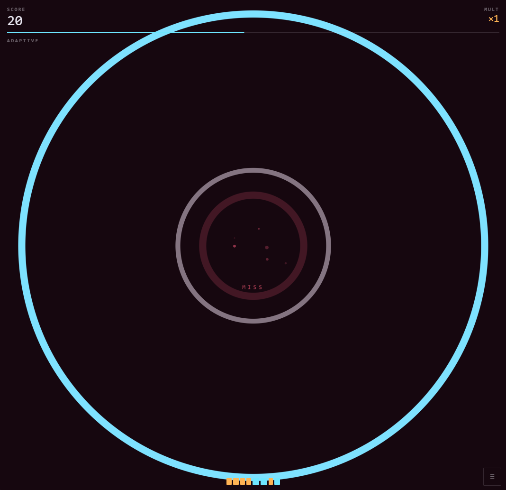

# PULSEFADE — прототип «Ритмичного кликера с затуханием»

Проверочный прототип по GDD: одно действие, меняющийся темп, оценка попадания и juice.
TypeScript + Vite + WebGL2, мобильный первым экраном, ECS внутри.



## Запуск

```bash
npm install
npm run dev        # http://localhost:5173, host:true — можно открыть с телефона в той же сети
npm run test       # vitest: окна оценки, счёт, генератор паттернов, симуляция раунда
npm run typecheck  # tsc --noEmit
npm run build      # typecheck + продакшн-сборка в dist/
```

VS Code: рекомендованные расширения предлагаются автоматически, `F5` поднимает dev-сервер и
Chrome с sourcemaps, задачи `npm: dev / typecheck / test` — в палитре команд.

## Управление

| Платформа | Тап               | Событие «два центра»                  |
| --------- | ----------------- | ------------------------------------- |
| Touch     | тап в любом месте | тап по нужной половине экрана         |
| Desktop   | пробел / ЛКМ      | `←` / `→` или клик по нужной половине |

`` ` `` — панель настройки баланса на лету (окна оценки, hit-stop, окно двойного тапа,
длительность удержания, звук, вибро, штраф за лишний тап). Она же открывается из меню режимов.

## Как решён главный риск GDD (§12)

Изменение темпа должно **сначала ощущаться, а уже потом требовать реакции**. Здесь это
не текстовая подсказка, а сама геометрия:

1. **Кольцо летит ровно столько, сколько длится предстоящий интервал**
   (`approachFollowsInterval`). Ускорение видно по скорости кольца до того, как в него надо попасть;
   пауза видна как медленно ползущее кольцо.
2. **Цвет кольца кодирует характер изменения**: янтарный — быстрее, голубой — медленнее/пауза,
   фиолетовый — сдвоенный удар.
3. **Лента темпа** внизу экрана: последние 8 интервалов как ширина штрихов. Дрейф темпа читается
   глазом как рисунок, а не угадывается.
4. **Темп меняется паттернами, а не RNG** (`domain/patterns/library.ts`), и вся
   последовательность детерминирована по seed.

## Архитектура

```
src/
  core/          ECS (World, SystemPipeline), часы с hit-stop, шина событий, seeded RNG
  config/        Tuning (весь баланс), режимы, палитра
  domain/        Чистая логика без DOM: оценка, счёт, паттерны темпа, генератор ударов
  game/          Компоненты, системы, резолверы событий, игровой контекст
  render/        IRenderer + WebGL2-реализация (инстансированный quad-батч)
  input/         Единый поток ввода: живой роутер и скриптованный (реплей)
  audio/ platform/  Синтез щелчков без ассетов, вибрация
  ui/            HUD, оверлеи, дебаг-панель (DOM поверх канваса)
  app/           Сборка раунда, запись партии, оболочка с режимами и дуэлью
```

### ECS

- Сущность — число, компонент — данные (`game/components.ts`), поведение — только в системах.
- `World.query()/view()` отдают сущности по набору компонентов; удаление отложено до `maintain()`,
  поэтому системы могут спокойно удалять во время обхода.
- Кадр = порядок систем в `RoundRunner`:

| #   | Система                           | Ответственность                                     |
| --- | --------------------------------- | --------------------------------------------------- |
| 1   | `BeatSpawnSystem`                 | рождает импульсы из `IBeatSource`                   |
| 2   | `JudgeSystem`                     | раздаёт импульсы резолверам, наказывает лишние тапы |
| 3   | `ScoreSystem`                     | счёт, combo, множитель                              |
| 4   | `FeedbackSystem`                  | hit-stop, частицы, кольца, звук, вибро              |
| 5   | `PulseVisualSystem`               | геометрия и цвет летящих колец                      |
| 6   | `TargetSystem`                    | мишень и два дополнительных центра                  |
| 7–9 | `Particle` / `Tween` / `Lifetime` | движение и затухание эффектов                       |
| 10  | `BackgroundSystem`                | пульсация фона по ступени серии                     |
| 11  | `RenderSystem`                    | единственный, кто знает про рендерер                |
| 12  | `RoundSystem`                     | условия конца раунда                                |
| 13  | `HudSystem`                       | цифры в DOM                                         |

### SOLID на практике

- **S** — каждая система делает одно; спавн, судейство, счёт и juice не пересекаются.
- **O** — новый тип импульса = новый `IBeatResolver` в реестре; новый режим = запись в `MODES`;
  новый паттерн темпа = запись в `PATTERNS`. `JudgeSystem` при этом не меняется.
- **L** — `PatternBeatSource` и `RecordedBeatSource` взаимозаменяемы за `IBeatSource`,
  живой ввод и реплей — за `IInputProvider`, правила подсчёта — за `IScoreRules`.
- **I** — узкие интерфейсы: `IRenderer`, `IAudio`, `IHaptics`, `IClock`, `IRng`.
- **D** — системы получают абстракции через конструктор; единственная точка, где создаётся WebGL,
  звук и DOM — `app/GameShell.ts`.

### Тайминг

Часы игровые, а не системные (`core/time/Clock.ts`). Hit-stop замораживает **всю** шкалу:
и `targetTime` ударов, и ввод живут в одной системе координат, поэтому остановка времени на
20–40 мс после PERFECT не сдвигает оценку следующего удара. Время нажатия берётся не на кадре,
а проецируется на момент DOM-события — точность не упирается в 60 Гц.

## Покрытие GDD

| Пункт                                             | Где                                                                                    |
| ------------------------------------------------- | -------------------------------------------------------------------------------------- |
| §3 первые 5 секунд, без меню                      | `GameShell.start()` — сразу Adaptive, первое кольцо в полёте                           |
| §4 одно действие                                  | `InputRouter` (pointer + пробел/ЛКМ)                                                   |
| §5 окна PERFECT/GREAT/OK/MISS                     | `domain/Judgement.ts`, значения в `config/Tuning.ts` + дебаг-панель                    |
| §6 паттерны темпа                                 | `domain/patterns/library.ts` (все шесть из документа + три для Chaos)                  |
| §7 core loop                                      | конвейер систем `RoundRunner`                                                          |
| §8 MVP: 30 с, счёт, множитель, экран              | `MODES.adaptive`, `DefaultScoreRules`, `ui/Hud.ts`                                     |
| §9 juice: hit-stop, вспышка, частицы, звук, вибро | `FeedbackSystem`                                                                       |
| §9 ступени серии 0–4 / 5–9 / 10–19 / 20+          | `streakTier` → частицы, вторичные кольца, пульсация фона                               |
| §10 режимы Adaptive/Chaos/Marathon/Zen/Duel       | `config/modes.ts`                                                                      |
| §10 события: двойной тап, удержание, два центра   | `game/resolvers/*`, включаются `eventChance` начиная с Chaos                           |
| §11 дуэль: общий seed, итог, повтор серии         | `GameShell.startDuel()`, `RunRecorder.buildReplay()`                                   |
| §12 честность смены темпа                         | см. раздел выше                                                                        |
| §13 условие успеха                                | «Ещё раз» — первая и единственная крупная кнопка результата, пробел/Enter дублируют её |

События (`double`, `hold`, `choice`) намеренно выключены в Adaptive (`eventChance: 0`):
сначала проверяется базовый one-tap, как и требует §10.

## Повтор лучшей серии

`RunRecorder` пишет удары и оценки, находит самую длинную серию без промахов и пересобирает её
в самостоятельный раунд: те же удары через `RecordedBeatSource`, те же тапы через
`ScriptedInputProvider`, с точным временем нажатий. Повтор проходит по тому же конвейеру систем,
поэтому оценки и эффекты совпадают с оригиналом — отдельного «плеера» нет.

## Тесты

`npm run test` — 20 проверок: границы окон оценки, рост множителя и обнуление на MISS,
детерминированность генератора по seed, ускорение Marathon, «воздух» после удержания, а также
headless-прогон полного раунда с ботом, попадающим ровно в `targetTime` (проверяет, что весь
конвейер работает и не течёт по сущностям).

## Что дальше по прототипу

Прототип отвечает на вопрос §2 (достаточно ли приятен один тап) — дальше меряется §13:
после MISS на длинной серии игрок должен почти автоматически нажимать «Ещё раз». Метрики
для этого уже пишутся (`RoundSummary`): score, максимальная серия, доля PERFECT, число промахов.
Первое, что стоит крутить в дебаг-панели, — ширина окна PERFECT и минимальное время подлёта:
именно они решают, ощущается ли промах своим.
